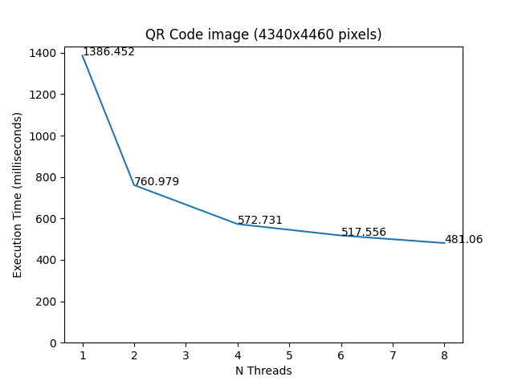

# Parallel QR Code Reader


### Description
- A simple QR code reading algorithm implemented in c++ using a sequence of image processing algorithms, accelerated using the OpenMP api.
- Given that a lot of image transformation algorithms don't contain loop dependencies, these algorithms are easilly parellelized using loop-level parallelism. Other algorithms used in this program, like the connected components algorithm, can be fairly easily partitioned, allowing for parallel execution of these algorithms as well. The aim of this project, is therefore, to study the impact on the execution time of a QR Code reader when parellizing these algorithms.
- Note: The program currently only supports png images and assumes that there is exactly one QR Code present in the image with 21x21 modules.

### Requirments
  - Unix based OS
  - g++
  - [libpng](http://www.libpng.org/pub/png/libpng.html)
  - [OpenMP](https://www.openmp.org/)

### Sequential Algorithm

The sequential algorithm, takes as input a pointer to an `Image` object, which contains an array of RGB pixels, and outputs the binary code of the QR Code contained in the image. To acheive this, the program is composed by 6 phases:

- **Binarization:** To convert the image from colored RGB to binary, the otsu threshold is used. This method allows for a threshold that is adaptable to each image, instead of a fixed hardcoded one, which might work better for some images than others.

- **Connected Components:** In order to detect all the different objects (components) in the image, the connected components algorithm is used. To ensure an efficient execution, the classic version of the algorithm was implemented (instead of the iterative). 
<!-- It should also be noted that even tho the computation of the transitive colsure is performed using a loop with a $N^2$ complexity, given that as the unions are completed, the adjacency lists involved in the union are ignored in the following iterations, the algorithm ends up with an acceptable execution time. -->

- **QR Code Positioning:** After the components have been labeled, the bounding boxes of all the components are computed, and the 3 QR Code positioning blocks are located by finding bounding boxes that share the same center and for which one of the bounding boxes is contained in the other. After this, it's determined which positioning blocks are which (Up-Left, Up-Right and Low-Left).

- **Selective Binarization:** Once the QR Code has been located within the image, a new otsu threshold is calculated, only using the pixels in the region of the QR Code. The original image is then binarized again using this new threshold. It was observed that by redoing the binarization with this more selective threshold, the subsequent reading of the QR Code becomes more precise.

- **Rotation and Shearing:** With the relative positions of the positioning blocks, it is determined how much the image should be rotated and sheared to ensure that the QR Code ends up straight and undistorted.

- **Binary Code Read:** After the image has been binarized, rotated and sheared, the value of each module of the QR Code is calculated using the mode in the region of pixels where (in theory) the module lies. To reduce the interference of pixels from neighbouring modules, instead of using the full region of pixels, only the inner half region of the pixels is actually considered.

### Parallelization

The parallelization of the program using OpenMP is done in three different modules:

- **Image Processor:** To parallelize the image transformation algorithms, I simply used the `omp parallel for` primitive. This way, each thread can compute an equally sized partition of the image simultaneously. Two other funcitons that are also parallelized using this primitive are the `getOtsuTheshold` and the `histogramGray` functions. The `getOtsuTheshold` functions requires some extra logic to select the best threshold between the best thresholds found by each thread, and the `histogramGray` functions requires some extra logic to sum of all the histograms computed by each thread.
<!-- 
    ```c++
    Image Transformations:

    #pragma omp parallel for
    for(int y = 0; y < img->height; y++)
    {
        for(int x = 0; x < img->width; x++)
        {
            ...
        }
    }
    ```

    ```c++
    Otsu:

    #pragma omp parallel
    {
        double best_var_priv = 0;
        int best_t_priv = 0;

        #pragma omp for
        for (int t = 0; t < N_COMP_VALS; t++)
        {
            double var = ...

            if (t == 0 || var > best_var_priv)
            {
                best_t_priv = t;
                best_var_priv = var;
            }
        }

        #pragma omp critical
        {
            if(best_var_priv > best_var)
            {
                best_var = best_var_priv;
                best_t = best_t_priv;
            }
        }
    }
    ``` -->

- **Connected Components:** To parallelize the connected components algorithm, the image is partitioned horizontally into $N$ equally sized partitions. $N$ threads then perform the connected components algorithm on each partition. Once all the threads have finished, the adjacencies between the borders of each partition are determined, and the labels affected by these adjecencies are replaced.

- **QR Code reading:** Once the image has been processed, the reading of the the modules of the QR Code is also parallelized simply using the `omp parallel for` primitive, allowing different modules to be processed simultaneously by multiple threads. Once all threads have finished, the binary codes generated by each thread are concatenated into the final code.

### Benchmarks

To test the impact of the parallelization of these algorithms a benchmark was developed. This benchmark processes the same image using the sequential and parallel versions of the program using 2,4,6 and 8 threads. It should be noted that all the programs were compiled using the `-O3` flag. To get more precise results, each configuration is executed 8 times, and then the average value of the execution times is used. The following plots show the values generated by this benchmark for 2 images. The first image having 2170x2230 pixels and the second 4340x4460 pixels. From these we can see we can get speedups up to $\approx 3.1$ and $\approx 2.9$ respectively. These speedups would likely be even higher if caching optimization techniques, like cache blocking, were implemented (future work).

|   |   |
|:---:|:---:|
|  |  |
| 2170x2230 Image | 4340x4460 Image |
